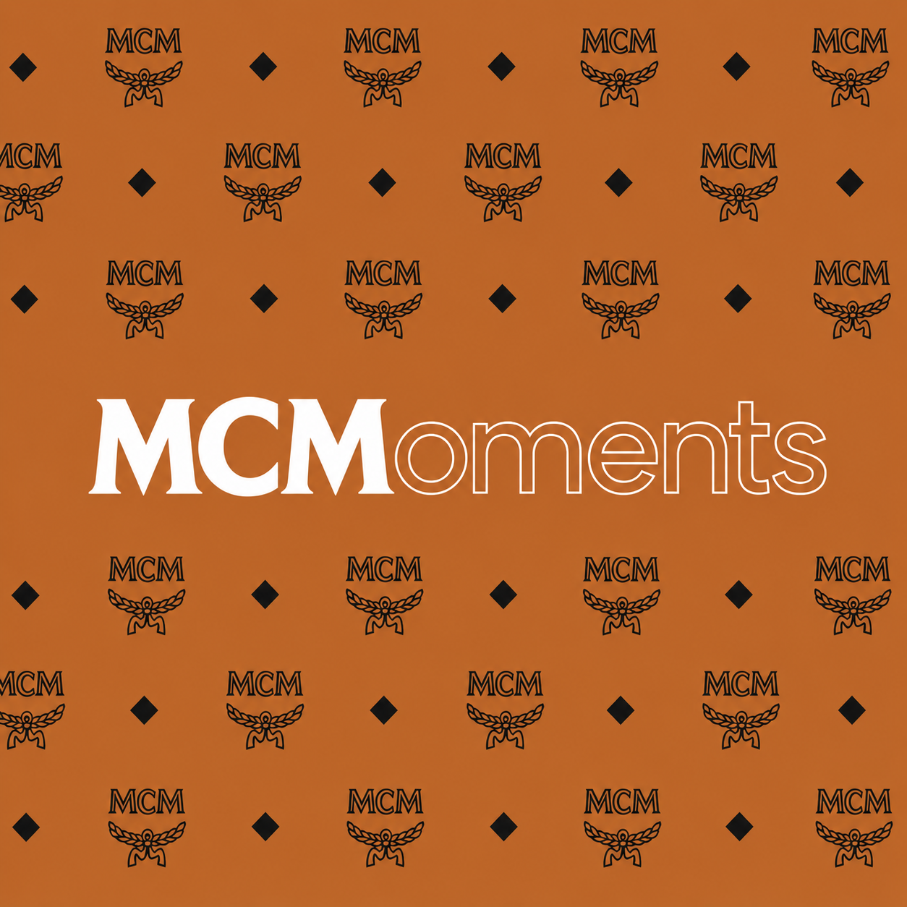
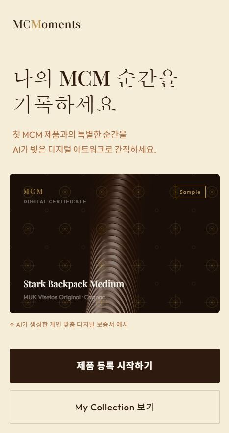
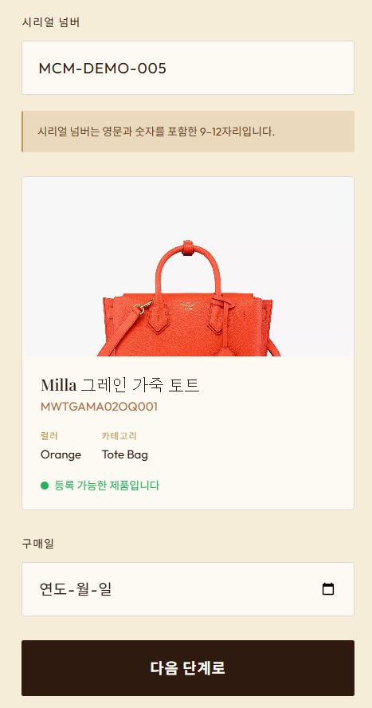
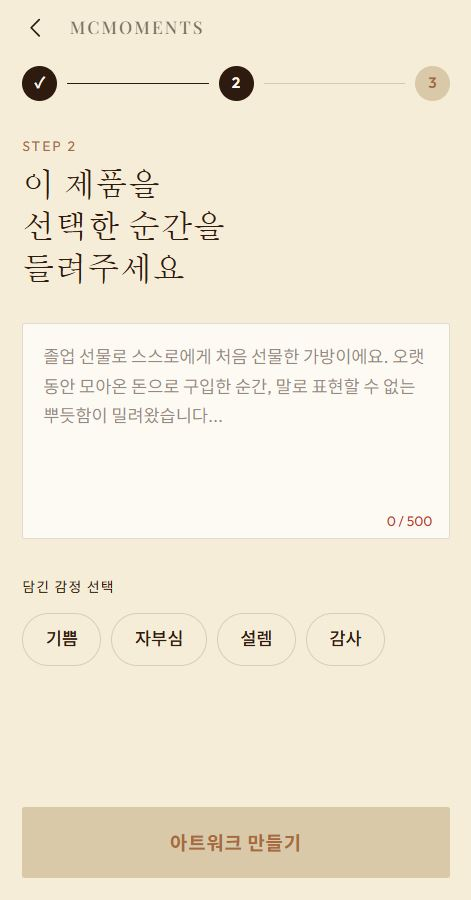
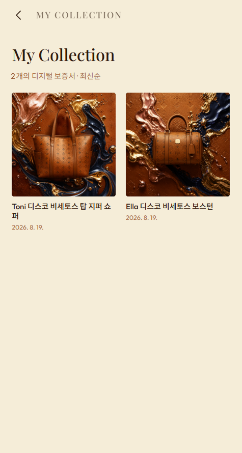
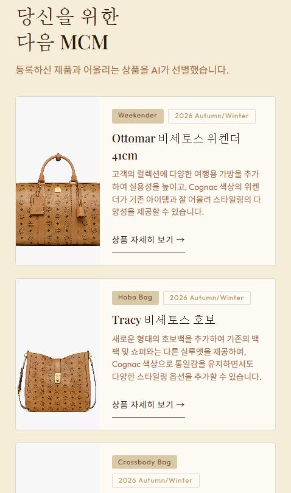
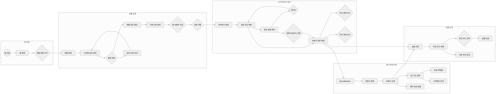
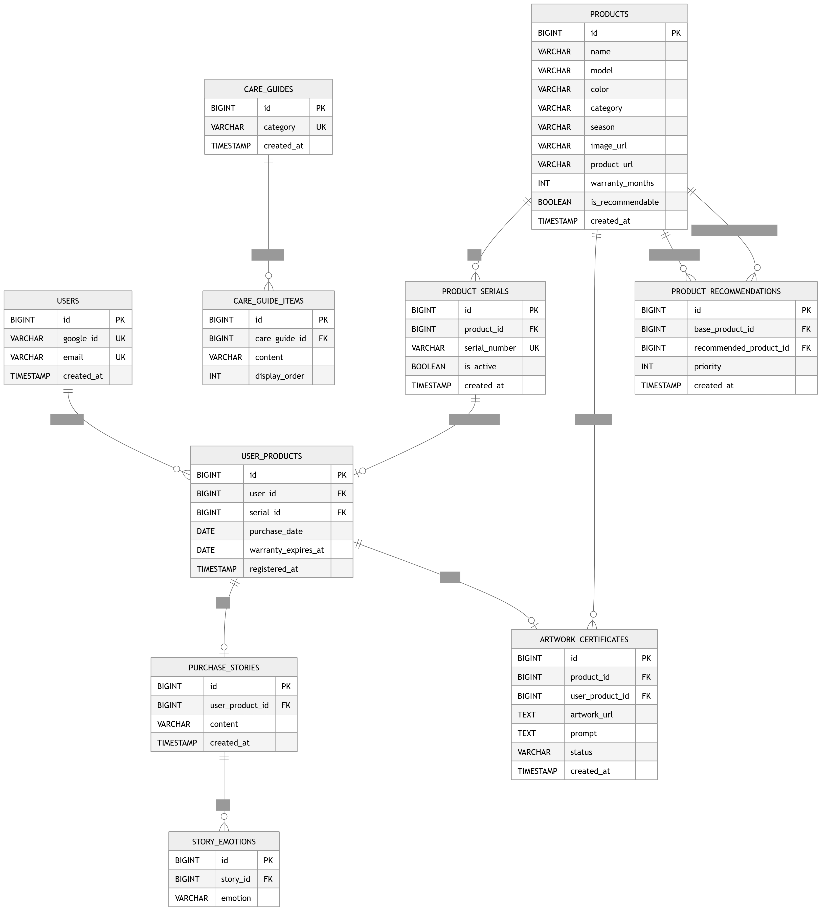

# MCMoments

<p align="center">
  
</p>

<p align="center">
  <b>당신의 첫 MCM, 그 순간을 작품으로.</b>
</p>

<p align="center">
  첫 MCM 제품 구매의 성취와 감정을 AI 디지털 아트워크 보증서로 기록하고,<br>
  나의 컬렉션을 기반으로 다음 시즌 상품까지 추천받는 디지털 럭셔리 다이어리
</p>

---

## 01. 프로젝트 소개

### MCMoments

첫 하이엔드 브랜드 구매는 취업, 승진, 졸업, 기념일 등 개인의 특별한 성취와 연결되는 경우가 많습니다.

하지만 구매 이후 제품에 담긴 감정과 이야기는 사진이나 영수증처럼 분산된 형태로 남게 됩니다.

**MCMoments**는 MCM 제품 정보와 사용자의 구매 사연을 기반으로 감정을 분석하고, MCM의 Visetos 패턴이 반영된 **AI 디지털 아트워크 보증서**를 생성합니다.

생성된 보증서는 **My Collection**에 저장하여 다시 열람할 수 있으며, 제품의 AS 기간과 관리 방법을 확인할 수 있습니다.

또한 사용자가 실제로 등록한 제품의 **모델, 색상, 카테고리**를 기반으로 다음 시즌에 어울리는 상품과 추천 이유를 제공합니다.

### 개발 기간

`2026.08.09 ~ 2026.08.19`

### 배포 주소

---

## 02. 주요 기능

### 1. 제품 등록

제품의 시리얼 넘버를 입력하여 등록 가능한 제품인지 확인합니다.

시리얼 검증이 완료되면 제품의 이름, 모델, 색상, 카테고리 등의 정보를 확인할 수 있습니다.

해커톤 MVP에서는 실제 MCM 정품 인증 시스템 대신 **데모용 허용 시리얼 목록**을 사용합니다.

---

### 2. 구매 사연 기록

사용자는 제품을 구매하게 된 계기와 당시의 감정을 **20~500자**로 기록할 수 있습니다.

예를 들어 첫 취업, 승진, 졸업, 기념일 등 제품과 연결된 개인적인 순간을 남길 수 있습니다.

---

### 3. AI 감정 분석

사용자가 작성한 구매 사연을 분석하여 이야기에서 나타나는 감정을 추출합니다.

주요 감정 유형은 다음과 같습니다.

`JOY` `PRIDE` `EXCITEMENT` `GRATITUDE` `HAPPINESS` `SATISFACTION` `LOVE` `AFFECTION` `NOSTALGIA` `COMFORT` `CONFIDENCE` `ACHIEVEMENT` `RELIEF` `SURPRISE` `ANTICIPATION` `SENTIMENTAL`

---

### 4. AI 디지털 아트워크

제품 정보와 구매 사연에서 분석된 감정을 기반으로 MCM의 Visetos 패턴이 반영된 개인 맞춤형 디지털 아트워크를 생성합니다.

```text
Product Information
        +
Purchase Story
        +
Emotion
        ↓
AI Artwork Generation
        ↓
Digital Artwork
```

아트워크는 다음 상태를 가집니다.

* `PENDING` : 생성 중
* `COMPLETED` : 생성 완료
* `FAILED` : 생성 실패

생성에 실패할 경우 재시도하거나 사전에 생성된 대체 아트워크를 사용할 수 있도록 구성합니다.

---

### 5. 디지털 보증서

AI로 생성된 아트워크와 제품 및 구매 정보를 하나의 디지털 보증서로 제공합니다.

디지털 보증서에서는 다음 정보를 확인할 수 있습니다.

* AI Artwork
* 제품명
* 모델
* 색상
* 카테고리
* 시리얼 넘버
* 구매일
* 구매 사연
* 감정
* 생성 시각

---

### 6. My Collection

생성한 디지털 보증서를 **My Collection**에 저장합니다.

사용자는 자신이 등록한 제품과 보증서를 목록으로 확인하고, 상세 화면에서 구매 당시의 이야기와 아트워크를 다시 열람할 수 있습니다.

---

### 7. After Care

등록 제품의 구매일과 제품별 보증 기간을 기반으로 AS 상태와 만료 예정일을 제공합니다.

또한 제품 카테고리에 맞는 세탁 및 보관 방법을 제공합니다.

```text
After Care

├── Warranty Status
├── Purchase Date
├── Warranty Expiration
└── Care Tips
```

---

### 8. 다음 시즌 상품 추천

사용자가 등록한 제품의 **모델, 색상, 카테고리**를 기반으로 어울리는 상품을 최대 3개 추천합니다.

단순 인기 상품을 제공하는 것이 아니라 사용자가 실제로 보유한 제품과 연결되는 상품을 추천하여 **My Collection을 확장하는 경험**을 제공합니다.

각 추천 상품에는 AI를 활용하여 생성한 **추천 이유**도 함께 제공합니다.

---

## 03. 화면 구성

| Home | Product Registration | Story |
| :---: | :------------------: | :---: |
|  |  |  |

| Artwork | My Collection | Recommendation |
| :-----: | :-----------: | :------------: |
|  |  |  |

---

## 04. User Flow



---

## 05. 기술 스택

### Frontend

  

### Backend

    

### Database


### Authentication

 

### AI


### Infra / Deploy

 

### Design & Collaboration

  

---

## 06. System Architecture

---

## 07. API

### Authentication

| Method | URL                            | 기능                          |
| ------ | ------------------------------ | --------------------------- |
| GET    | `/oauth2/authorization/google` | Google 로그인 시작               |
| GET    | `/login/oauth2/code/google`    | Google 인증 Callback 및 JWT 발급 |

### Product

| Method | URL                              | 기능                   |
| ------ | -------------------------------- | -------------------- |
| POST   | `/api/v1/products/serial/verify` | 시리얼 번호 검증 및 제품 정보 조회 |
| POST   | `/api/v1/user-products`          | 제품 및 구매 정보 최종 등록     |

### Artwork

| Method | URL                                     | 기능                 |
| ------ | --------------------------------------- | ------------------ |
| POST   | `/api/v1/products/{productId}/artworks` | AI 아트워크 생성         |
| GET    | `/api/v1/artworks/{artworkId}`          | 아트워크 생성 상태 및 결과 조회 |

### Collection

| Method | URL                                               | 기능                  |
| ------ | ------------------------------------------------- | ------------------- |
| GET    | `/api/v1/collections`                             | My Collection 목록 조회 |
| GET    | `/api/v1/collections/{artworkId}`                 | 디지털 보증서 상세 조회       |
| GET    | `/api/v1/user-products/{userProductId}/aftercare` | AS 상태 및 관리 방법 조회    |

### Recommendation

| Method | URL                                      | 기능                |
| ------ | ---------------------------------------- | ----------------- |
| GET    | `/api/v1/users/{userId}/recommendations` | 등록 제품 기반 추천 상품 조회 |

> 상세 Request / Response는 별도의 API 명세 문서에서 관리합니다.

---

## 08. ERD



### 주요 테이블

| Table                     | 설명                     |
| ------------------------- | ---------------------- |
| `users`                   | Google OAuth 기반 사용자 정보 |
| `products`                | MCM 제품 기본 정보           |
| `product_serials`         | 제품별 시리얼 정보             |
| `user_products`           | 사용자가 등록한 제품            |
| `purchase_stories`        | 제품 구매 사연               |
| `story_emotions`          | 구매 사연에서 분석된 감정         |
| `artwork_certificates`    | AI 디지털 아트워크 보증서        |
| `care_guides`             | 카테고리별 제품 관리 가이드        |
| `care_guide_items`        | 관리 가이드 상세 항목           |
| `product_recommendations` | 제품 간 추천 관계             |

---

## 09. 시작 가이드

### Requirements

프로젝트 실행을 위해 다음 환경이 필요합니다.

```text
Java 17+
Spring Boot 3.x
MySQL 8.x
Node.js
npm
```

### Repository Clone

```bash
git clone <REPOSITORY_URL>
cd <PROJECT_DIRECTORY>
```

### Frontend

```bash
cd frontend

npm install
npm run dev
```

### Backend

```bash
cd backend

./gradlew build
./gradlew bootRun
```

Windows:

```bash
gradlew.bat bootRun
```

---

## 10. Environment Variables

프로젝트 실행을 위해 Database, Google OAuth, JWT 및 AI API 관련 환경변수가 필요합니다.

```env
# Database
DB_URL=
DB_USERNAME=
DB_PASSWORD=

# Google OAuth
GOOGLE_CLIENT_ID=
GOOGLE_CLIENT_SECRET=

# JWT
JWT_SECRET=

# AI
AI_API_KEY=
```

> API Key, Client Secret 등의 민감 정보는 Repository에 Commit하지 않습니다.

---

## 11. Team

| 이름 | 역할       | 담당                      |
| -- | -------- | ----------------------- |
| 채린 | Backend  | Authentication, Product |
| 준수 | Backend  | Artwork, Recommendation |
| 재원 | Backend  | Collection              |
| 추가 | Frontend | 추가                      |
| 추가 | Frontend | 추가                      |

---

## 12. Git Convention

### Branch Strategy

```text
main
 ├── feature/{issue-number}-{feature}
 └── fix/{issue-number}-{feature}
```

### Commit Convention

| Type       | 설명         |
| ---------- | ---------- |
| `feat`     | 새로운 기능 추가  |
| `fix`      | 버그 수정      |
| `refactor` | 코드 리팩토링    |
| `docs`     | 문서 수정      |
| `test`     | 테스트 코드     |
| `chore`    | 설정 및 기타 작업 |

---

## 13. MVP Scope

### Included

* Google OAuth 로그인
* 시리얼 넘버 기반 제품 등록
* 제품 기본 정보 조회
* 구매 사연 입력
* AI 감정 분석
* AI 디지털 아트워크 생성
* 아트워크 생성 상태 조회
* 생성 실패 시 재시도 및 대체 아트워크
* My Collection 저장 및 조회
* 디지털 보증서 상세 조회
* AS 기간 상태 및 만료 예정 안내
* 카테고리별 세탁 및 보관 방법
* 등록 제품 기반 상품 추천
* AI 추천 이유 생성
* 추천 상품 상세 페이지 연결

### Not Included

* 실제 MCM 정품 인증
* 실제 AS 접수 및 수선 예약
* 개인별 보증 기간 자동 검증
* 실시간 재고 및 가격 조회
* 실시간 신상품 데이터 수집
* 실시간 3D 제품 조작
* 보증서 외부 공유
* 다중 사용자 실시간 동기화

---

## 14. Documentation

프로젝트의 상세 설계 및 개발 문서는 Notion에서 관리하고 있습니다. 
[MCMoments Notion](https://rural-pint-aeb.notion.site/Documents-3c15855575d780489227c26c5d9363f6?source=copy_link)

- API Specification
- ERD
- System Architecture
- Troubleshooting & Technical Decisions
- 개발 및 협업 문서

---

<p align="center">
  <b>당신의 첫 MCM, 그 순간을 작품으로.</b>
</p>
